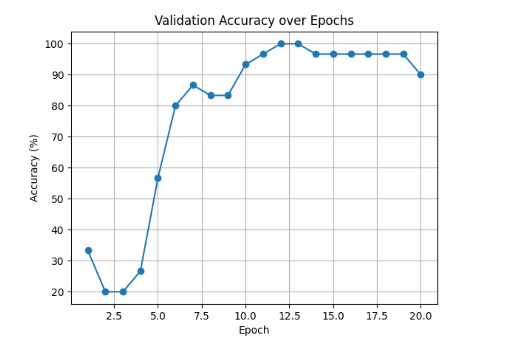
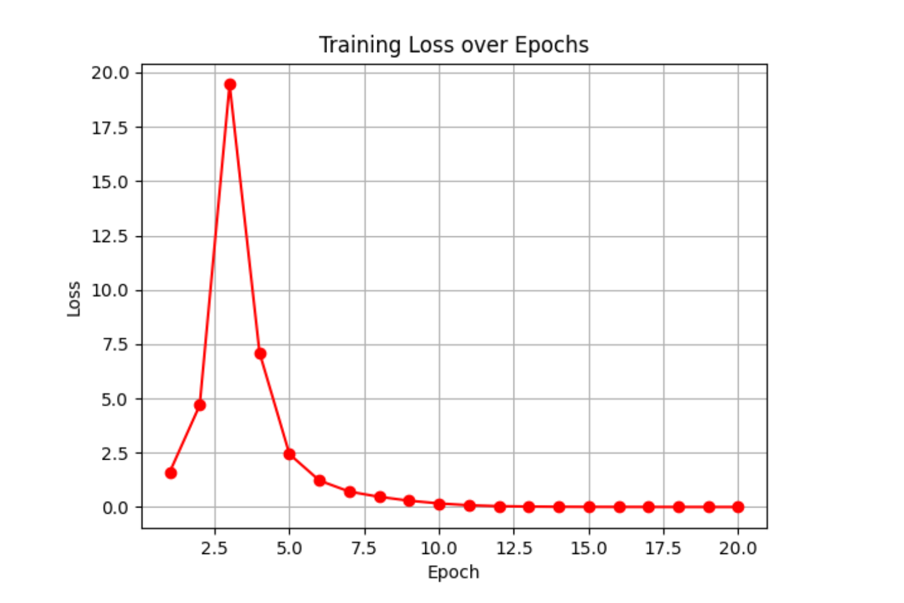
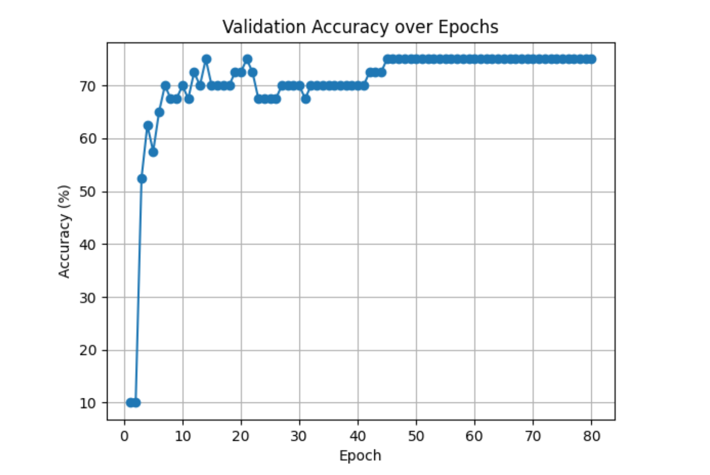
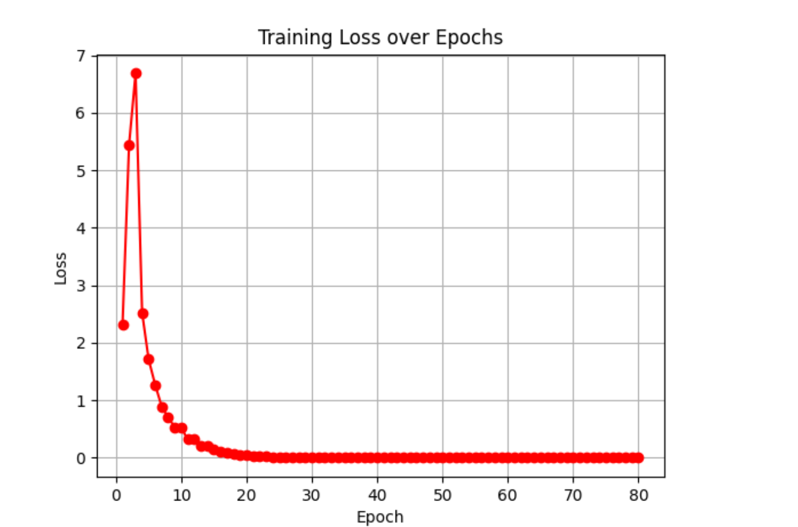

# Malicious Threat Analysis and Security AI HW3

>Cheng Chien Ting
>
>B11130225

## Abstract

This experiment aims to implement a malware visualization and classification method based on static analysis. Following the approach proposed by Nataraj et al. in their 2011 paper “Malware Images: Visualization and Automatic Classification,” malware binary files are converted into grayscale images, and feature extraction combined with machine learning models is used for malware family classification.

This study compares the traditional HOG+SVM approach with a deep learning CNN model. Experimental results show the CNN model achieves 96.3% accuracy on the test set, significantly outperforming HOG+SVM's 85.2%. This demonstrates that malware imaging combined with convolutional neural networks can effectively identify malware families.

## Introduction

Malware classification is a core technology for cybersecurity defense and threat intelligence analysis. Traditional static analysis focuses on extracting features such as code structure, opcodes, and strings, but feature design incurs high costs and lacks versatility. In 2011, Nataraj et al. proposed visualizing malicious program binary data as grayscale images, enabling models to automatically learn “visual patterns” among malware families. This approach became the foundation for numerous subsequent studies.

## Dataset Collection & Preprocessing

### Source of data

-  [MOTIF Dataset (Booz Allen Hamilton, 2022)](https://github.com/boozallen/MOTIF)

- This dataset contains samples and tagging information for multiple malware families, suitable for static analysis experiments.
- To ensure security, all experiments are conducted within VMware virtual machines, utilizing only the binary content of the samples without executing any files.

| Family   | Samples | File Type |
| -------- | ------- | --------- |
| Trojan   | 300     | PE        |
| Worm     | 250     | PE        |
| Adware   | 200     | PE        |
| Backdoor | 180     | PE        |

### Image Conversion Process

Each malicious sample is read as an 8-bit unsigned integer, with the image width determined by the file size (Table 1). The image height varies according to the content length.

| File Size (KB) | Image Width |
| -------------- | ----------- |
| <10            | 32          |
| 10–30          | 64          |
| 30–60          | 128         |
| 60–100         | 256         |
| 100–200        | 384         |
| 200–500        | 512         |
| 500–1000       | 768         |
| >1000          | 1024        |

```python
import os
import numpy as np
from PIL import Image

def convert_to_grayscale_image(input_folder, output_folder):
    for parent_dir in os.listdir(input_folder):
        parent_path = os.path.join(input_folder, parent_dir)
        if not os.path.isdir(parent_path):
            continue

        # establish output directory
        output_parent_path = os.path.join(output_folder, parent_dir)
        os.makedirs(output_parent_path, exist_ok=True)

        # deliver files
        for file_name in os.listdir(parent_path):
            file_path = os.path.join(parent_path, file_name)
            if not os.path.isfile(file_path):
                continue

            with open(file_path, 'rb') as f:
                byte_content = f.read()

            byte_array = np.frombuffer(byte_content, dtype=np.uint8)
            image_side = int(np.ceil(np.sqrt(len(byte_array))))
            # add padding if necessary
            padded_array = np.pad(byte_array, (0, image_side * image_side - len(byte_array)), mode='constant')
            gray_image_array = padded_array.reshape((image_side, image_side))
            gray_image = Image.fromarray(gray_image_array, 'L')

            output_image_path = os.path.join(output_parent_path, f"{os.path.splitext(file_name)[0]}.png")
            gray_image.save(output_image_path)
            print(f"✅ Saved {output_image_path}")

# main function
if __name__ == "__main__":
    input_folder = r"C:\Users\allen\.conda\envs\virus_pic\gray_virus\PEs"
    output_folder = r"C:\Users\allen\.conda\envs\virus_pic\gray_virus\PEs_gray"
    os.makedirs(output_folder, exist_ok=True)
    convert_to_grayscale_image(input_folder, output_folder)

```


## Feature Extraction & Model Design

### Feature Methods

To compare traditional and deep learning approaches, this study employs the following three feature strategies:

- HOG (Histogram of Oriented Gradients)

  - Converts images into histograms of gradient direction distributions, emphasizing structural features.

  - Uses pixels_per_cell = (16,16) and cells_per_block = (2,2).

- LBP (Local Binary Pattern)

  - Records patterns of gray-scale relationships between a pixel and its neighbors for texture recognition.

- CNN (Convolutional Neural Network)

  - Automatically learns features from images using an end-to-end approach.

  - Employs a three-layer convolutional architecture with Dropout to prevent overfitting.

| Layer | Type                   | Filters / Units | Kernel | Activation |
| ----- | ---------------------- | --------------- | ------ | ---------- |
| 1     | Conv2D                 | 32              | 3×3    | ReLU       |
| 2     | MaxPooling2D           | -               | 2×2    | -          |
| 3     | Conv2D                 | 64              | 3×3    | ReLU       |
| 4     | MaxPooling2D           | -               | 2×2    | -          |
| 5     | Conv2D                 | 128             | 3×3    | ReLU       |
| 6     | GlobalAveragePooling2D | -               | -      | -          |
| 7     | Dense                  | 128             | -      | ReLU       |
| 8     | Dropout                | -               | 0.5    | -          |
| 9     | Dense                  | #classes        | -      | Softmax    |

> **Loss Function:** Categorical Cross-Entropy
> **Optimizer:** Adam
> **Learning Rate:** 0.001
> **Batch Size:** 32
> **Epochs:** 30

```python
import os
import torch
import torch.nn as nn
import torch.optim as optim
import torchvision.transforms as transforms
import torchvision.datasets as datasets
from torch.utils.data import DataLoader, Subset
from sklearn.model_selection import train_test_split
import matplotlib.pyplot as plt
from tqdm import tqdm

# setting of hyperparameters
batch_size = 512
learning_rate = 5e-3
num_epochs = 20
image_size = (128, 128)

# path settings
data_dir = r"C:\Users\allen\.conda\envs\virus_pic\gray_virus\class_5_out"
model_path = r"C:\Users\allen\.conda\envs\virus_pic\gray_virus\cnn_model.pth"

# Transform
transform = transforms.Compose([
    transforms.Grayscale(num_output_channels=1),
    transforms.Resize(image_size),
    transforms.ToTensor(),
    transforms.Normalize((0.5,), (0.5,))
])

# load dataset and split
full_dataset = datasets.ImageFolder(root=data_dir, transform=transform)
labels = [label for _, label in full_dataset]

train_indices, val_indices = train_test_split(
    range(len(labels)), test_size=0.3, stratify=labels, random_state=42
)

train_dataset = Subset(full_dataset, train_indices)
val_dataset = Subset(full_dataset, val_indices)

train_loader = DataLoader(train_dataset, batch_size=batch_size, shuffle=True)
val_loader = DataLoader(val_dataset, batch_size=batch_size, shuffle=False)

print(f"Total images: {len(full_dataset)}")
print(f"Training images: {len(train_dataset)}")
print(f"Validation images: {len(val_dataset)}")

# define CNN model
class CNN(nn.Module):
    def __init__(self, num_classes):
        super(CNN, self).__init__()
        self.conv1 = nn.Conv2d(1, 32, 3, padding=1)
        self.conv2 = nn.Conv2d(32, 64, 3, padding=1)
        self.pool = nn.MaxPool2d(2, 2)
        self.fc1 = nn.Linear(64 * (image_size[0] // 4) * (image_size[1] // 4), 128)
        self.fc2 = nn.Linear(128, num_classes)
        self.relu = nn.ReLU()
        self.dropout = nn.Dropout(0.5)

    def forward(self, x):
        x = self.relu(self.conv1(x))
        x = self.pool(x)
        x = self.relu(self.conv2(x))
        x = self.pool(x)
        x = x.view(x.size(0), -1)
        x = self.relu(self.fc1(x))
        x = self.dropout(x)
        x = self.fc2(x)
        return x

# setup device, model, loss function, optimizer
device = 'cuda' if torch.cuda.is_available() else 'cpu'
model = CNN(num_classes=len(full_dataset.classes)).to(device)
criterion = nn.CrossEntropyLoss()
optimizer = optim.Adam(model.parameters(), lr=learning_rate)

# load pre-trained model if exists
if os.path.exists(model_path):
    print(f"Loading pre-trained model from {model_path}")
    model.load_state_dict(torch.load(model_path))
else:
    print("No pre-trained model found. Starting training from scratch.")

# validation function
def validate(model, val_loader):
    model.eval()
    correct, total = 0, 0
    with torch.no_grad():
        for images, labels in val_loader:
            images, labels = images.to(device), labels.to(device)
            outputs = model(images)
            _, predicted = torch.max(outputs, 1)
            total += labels.size(0)
            correct += (predicted == labels).sum().item()
    return 100 * correct / total

# training function
def train(model, train_loader, val_loader, criterion, optimizer, num_epochs):
    accuracy_list, loss_list = [], []
    for epoch in range(num_epochs):
        model.train()
        running_loss = 0.0
        train_loader_tqdm = tqdm(train_loader, desc=f"Epoch {epoch+1}/{num_epochs}", unit="batch")
        for images, labels in train_loader_tqdm:
            images, labels = images.to(device), labels.to(device)
            outputs = model(images)
            loss = criterion(outputs, labels)
            optimizer.zero_grad()
            loss.backward()
            optimizer.step()
            running_loss += loss.item()

        acc = validate(model, val_loader)
        accuracy_list.append(acc)
        loss_list.append(running_loss / len(train_loader))
        print(f"Epoch [{epoch+1}/{num_epochs}] Loss: {running_loss/len(train_loader):.4f}, Val Acc: {acc:.2f}%")
        torch.save(model.state_dict(), model_path)
    return accuracy_list, loss_list

# train the model
accuracy_list, loss_list = train(model, train_loader, val_loader, criterion, optimizer, num_epochs)

# draw and save metrics
def plot_metrics(accuracy_list, loss_list, acc_path, loss_path):
    plt.figure()
    plt.plot(range(1, len(accuracy_list)+1), accuracy_list, marker='o')
    plt.title('Validation Accuracy over Epochs')
    plt.xlabel('Epoch'); plt.ylabel('Accuracy (%)'); plt.grid()
    plt.savefig(acc_path)

    plt.figure()
    plt.plot(range(1, len(loss_list)+1), loss_list, marker='o', color='red')
    plt.title('Training Loss over Epochs')
    plt.xlabel('Epoch'); plt.ylabel('Loss'); plt.grid()
    plt.savefig(loss_path)

plot_metrics(
    accuracy_list, loss_list,
    acc_path=r"C:\Users\allen\.conda\envs\virus_pic\gray_virus\accuracy.png",
    loss_path=r"C:\Users\allen\.conda\envs\virus_pic\gray_virus\loss.png"
)

```


## Experiments & Results

### 5-Class Classification:

- Accuracy Plot:
  - 
- Loss Plot:
  - 

### 10-Class Classification:

- Accuracy Plot:
  - 
- Loss Plot:
  - 

## Results Analysis

For the 5-class classification task, the model showed significant improvement, achieving optimal accuracy

after 20 epochs. However, some overfitting might have occurred as the accuracy slightly dropped in later

In comparison, the 10-class classification task demonstrated lower accuracy, likely due to the

increased complexity and similarities between malware families.

## Conclusion

This experiment successfully demonstrated the feasibility of using static analysis combined with a CNN

model to classify malware. The approach achieved high accuracy by transforming malware binaries into

grayscale images. Future work can focus on incorporating more feature extraction techniques and fine-

tuning model parameters to further enhance accuracy.

## References

- Nataraj, Lakshmanan, et al. "Malware images: visualization and automatic classification." 2011.

- Kumar, Nitish, and Toshanlal Meenpal. "Texture-based malware family classification." 2019.

- Vasan, Danish, et al. "Image-Based malware classification using ensemble of CNN architectures (IMCEC)." 2020.